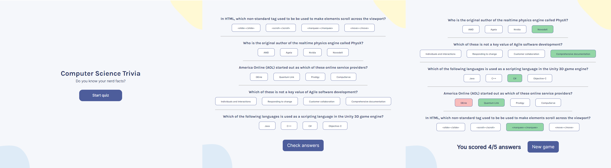

# Scrimba-React-Project-Quizzical
Solo project assigned at the end of the React course on Scrimba.com

The project's design was provided through a [Figma prototype](https://www.figma.com/file/E9S5iPcm10f0RIHK8mCqKL/Quizzical-App?node-id=0%3A1)

This is the end result:

